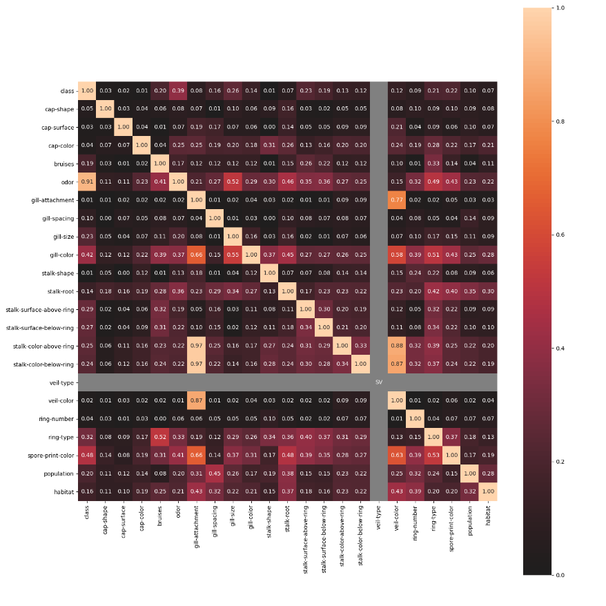
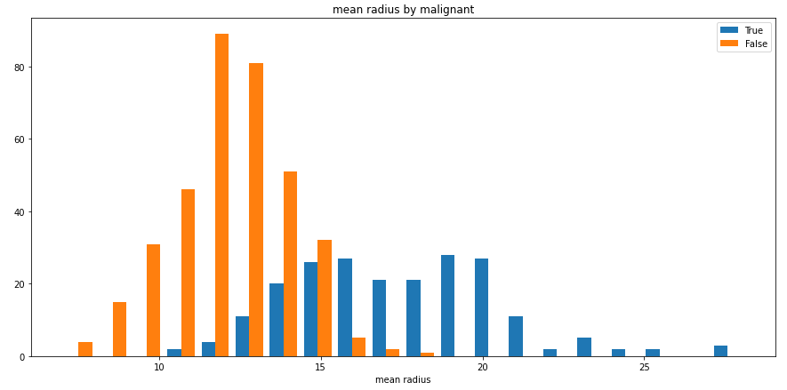

# Examples

_Examples can be imported and executed from `dython.examples`._

#### `associations_iris_example()`

Plot an example of an associations heat-map of the Iris dataset features. 
All features of this dataset are numerical (except for the target).

**Example code:**
```python
import pandas as pd
from sklearn import datasets
from dython.nominal import associations

# Load data 
iris = datasets.load_iris()

# Convert int classes to strings to allow associations 
# method to automatically recognize categorical columns
target = ['C{}'.format(i) for i in iris.target]

# Prepare data
X = pd.DataFrame(data=iris.data, columns=iris.feature_names)
y = pd.DataFrame(data=target, columns=['target'])
df = pd.concat([X, y], axis=1)

# Plot features associations
associations(df)
```
**Output:**


__________________

#### `associations_mushrooms_example()`

Plot an example of an associations heat-map of the UCI Mushrooms dataset features.
All features of this dataset are categorical. This example will use Theil's U.

**Example code:**
```python
import pandas as pd
from dython.nominal import associations

# Download and load data from UCI
df = pd.read_csv('http://archive.ics.uci.edu/ml/machine-learning-databases/mushroom/agaricus-lepiota.data')
df.columns = ['class', 'cap-shape', 'cap-surface', 'cap-color', 'bruises', 'odor', 'gill-attachment',
              'gill-spacing', 'gill-size', 'gill-color', 'stalk-shape', 'stalk-root', 'stalk-surface-above-ring',
              'stalk-surface-below-ring', 'stalk-color-above-ring', 'stalk-color-below-ring', 'veil-type',
              'veil-color', 'ring-number', 'ring-type', 'spore-print-color', 'population', 'habitat']

# Plot features associations
associations(df, theil_u=True, figsize=(15, 15))
```
**Output:**



__________________

#### `roc_graph_example()`

Plot an example ROC graph of an SVM model predictions over the Iris dataset.

Based on `sklearn` [examples](http://scikit-learn.org/stable/auto_examples/model_selection/plot_roc.html) 
(as was seen on April 2018).

**Example code:**
```python
import numpy as np
from sklearn import svm, datasets
from sklearn.model_selection import train_test_split
from sklearn.preprocessing import label_binarize
from sklearn.multiclass import OneVsRestClassifier
from dython.model_utils import roc_graph

# Load data
iris = datasets.load_iris()
X = iris.data
y = label_binarize(iris.target, classes=[0, 1, 2])

# Add noisy features
random_state = np.random.RandomState(4)
n_samples, n_features = X.shape
X = np.c_[X, random_state.randn(n_samples, 200 * n_features)]

# Train a model
X_train, X_test, y_train, y_test = train_test_split(X, y, test_size=.5, random_state=0)
classifier = OneVsRestClassifier(svm.SVC(kernel='linear', probability=True, random_state=0))

# Predict
y_score = classifier.fit(X_train, y_train).predict_proba(X_test)

# Plot ROC graphs
roc_graph(y_test, y_score, class_names=iris.target_names)
```

**Output:**


!!! warning "Note:" 

	Due to the nature of `np.random.RandomState` which is used in this 
	example, the output graph may vary from one machine to another.

__________________	

#### `split_hist_example()`

Plot an example of split histogram of data from the breast-cancer dataset.

While this example presents a numerical column split by a categorical one, categorical columns can also be used
as the values, as well as numerical columns as the split criteria.

**Example code:**
```python
import pandas as pd
from sklearn import datasets
from dython.data_utils import split_hist

# Load data and convert to DataFrame
data = datasets.load_breast_cancer()
df = pd.DataFrame(data=data.data, columns=data.feature_names)
df['malignant'] = [not bool(x) for x in data.target]

# Plot histogram
split_hist(df, 'mean radius', 'malignant', bins=20, figsize=(15,7))
```

**Output:**


 